# **Foreign Direct Investment (FDI) in USA: Data Munging & Plotting**
Group Members: Bruce Muckerson, Ed Yancik, Julie Gandre, Michael Donatucci, and Sabrina Saleh

## Research Question
* Total stock of Inward-FDI in the USA in 2019: 4458.36 (billion USD) 
* Total stock of Inward-FDI in the USA in 2018: 4127.18 (billion USD)
    - Which countries invest more in the USA? 

## Hypotheses:       
1. Countries' economic level impacts their FDI in the USA. 
2. Countries' innovation & technology impacts their FDI in the USA.
3. Countries' business infrastructure impacts their FDI in the USA.

## Variables, Measures, & Dataset 
* Time of Analysis: Year 2018
   
* Dependent Variable: FDI in the USA
    - Measure: Total stock of FDI by countries in the USA (in million USD)
    - Dataset: Bureau of Economic Analysis; https://www.bea.gov
    
    
* Independent Variable (H1): Investing countries' state of economy
    - Measure: Gross Domestic Product (GDP) of investing countries (in million USD)
    - Dataset: World Bank API; https://pypi.org/project/world-bank-data/
    
    
* Independent Variable (H2): Investing countries' state of innovation & technology
    - Measure: High technology exports by investing countries (in million USD)
    - Dataset: World Bank; https://data.worldbank.org
    
    
* Independent Variable (H3): Investing countries' business infrastructure
    - Measure: Doing Business Indicator of investing countries (in score of 100)
    - Dataset: World Bank; https://data.worldbank.org

## Technologies for Data Analysis 
* pandas
* numpy
* world_bank_data, requests, & json
* scipy.stats
* LinearRegression from sklearn.linear_model
* plotly
* plotly.express
* mapbox_token

## Link of Notebook  
* [main.ipynb](https://github.com/sabrinasaleh/Project_FDI_USA/blob/master/main.ipynb): Notebook with all the codes for data cleaning, merging, analysis, and visualization.

## Sample Size & Basic Statistics: 180 Countries
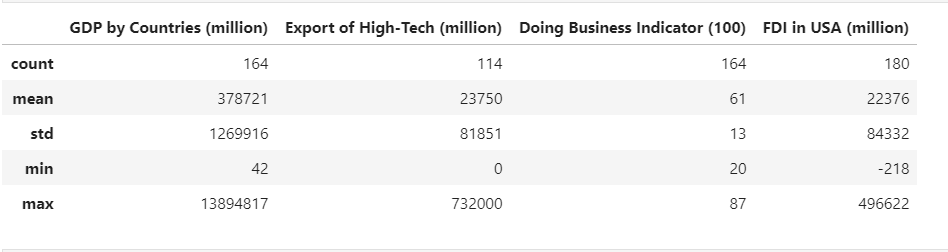

## Rank of Countries by Dependent Variable  
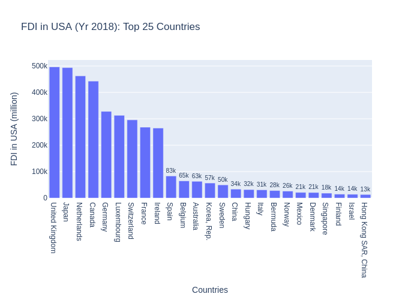

## Rank of Countries by Independent Variables  
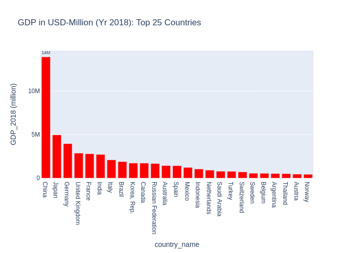 
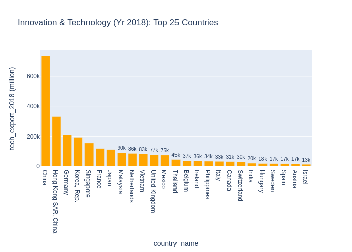  
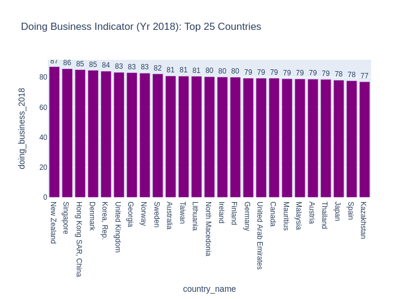

## Dependent Variable Mean by Regions 
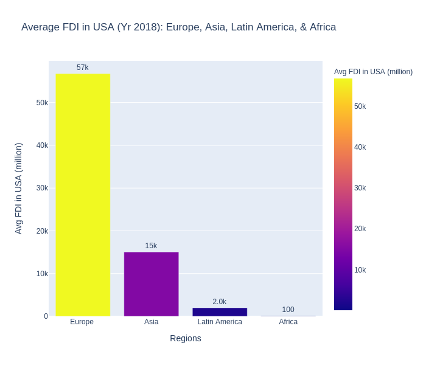

## Independent Variables Means by Regions
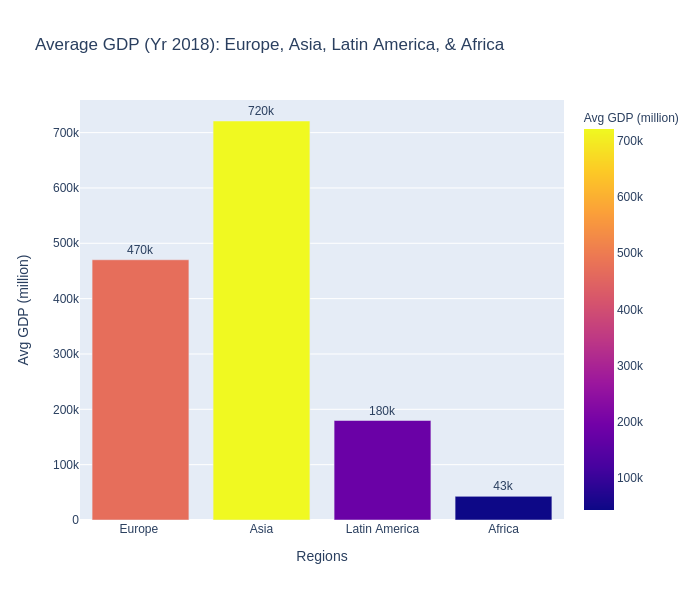
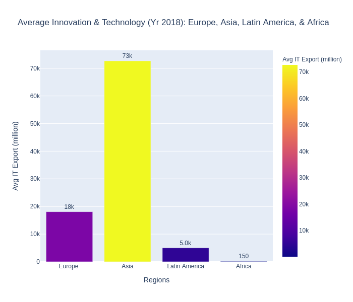
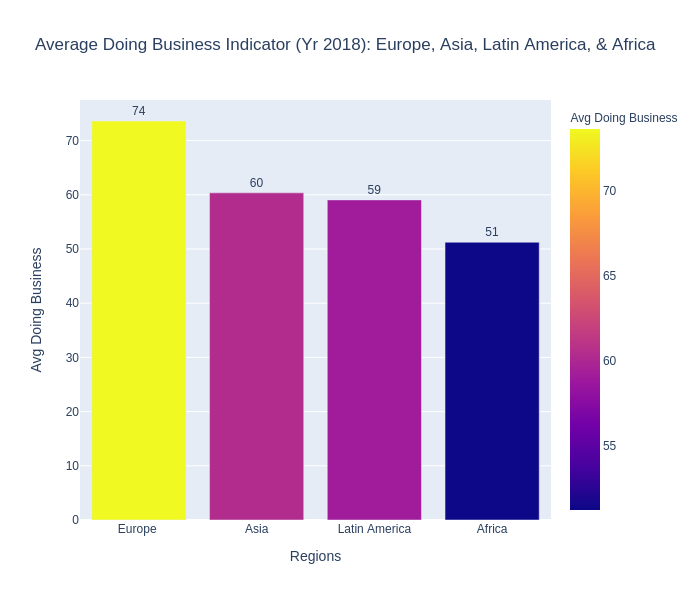

## H1: Countries' economic level impacts their FDI in the USA
* The correlation between FDI in USA and GDP by countries is 0.35
* The linear regression model for FDI in USA vs GDP by countries is y = 22874.11 + 0.02x with R-Square=0.13
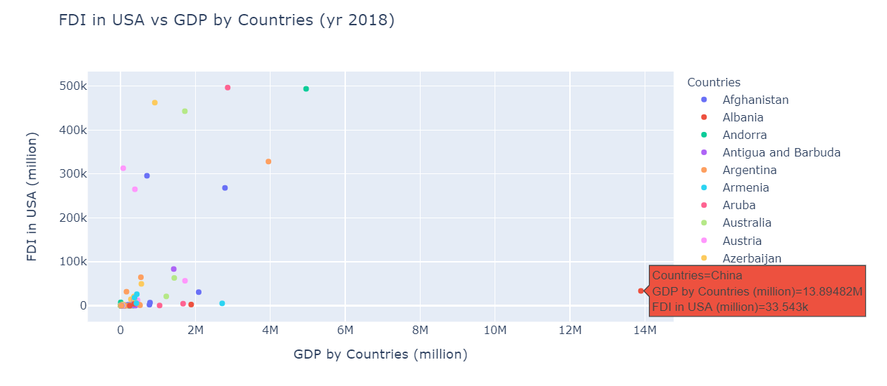

## H2: Countries' innovation & technology impacts their FDI in the USA
* The correlation between FDI in USA and Innovation & Technology by countries is 0.23
* The linear regression model for FDI in USA vs Innovation & Technology by countries is y = 29450.14 + 0.29x with R-Square=0.05
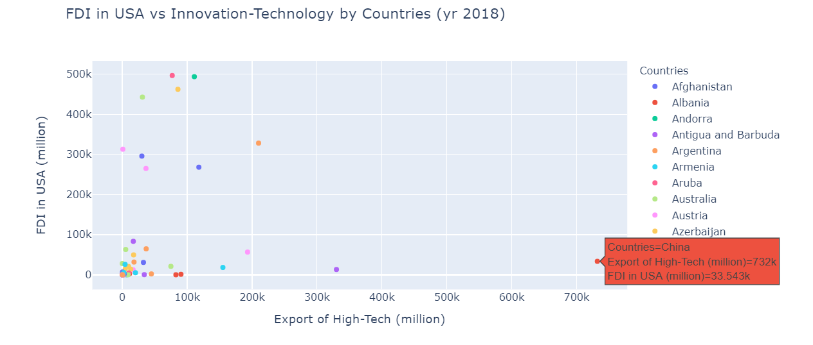

## H3: Countries' business infrastructure impacts their FDI in the USA
* The correlation between FDI in USA and Doing Business Indicator by countries is 0.35
* The linear regression model for FDI in USA vs Doing Business Indicator by countries is y = -185483.5 + 3343.94x with R-Square=0.12
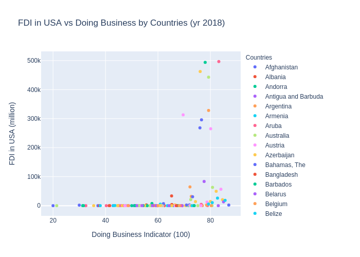

## Data Visualization in the Global Map
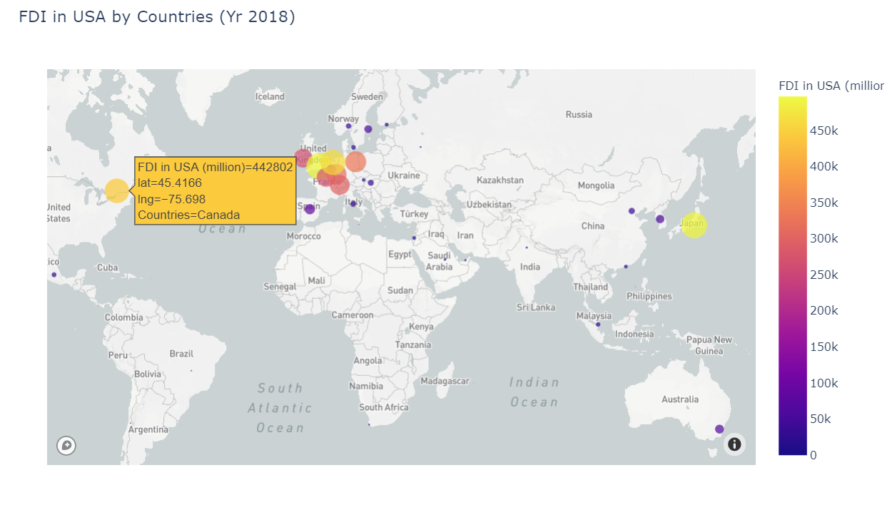
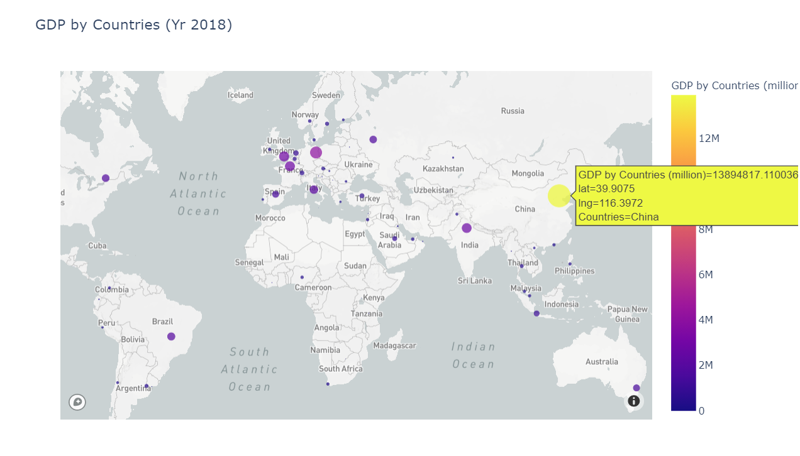
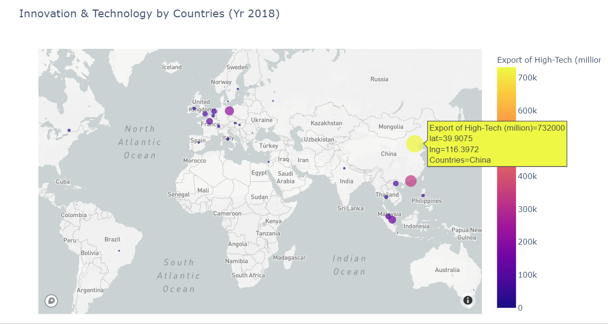
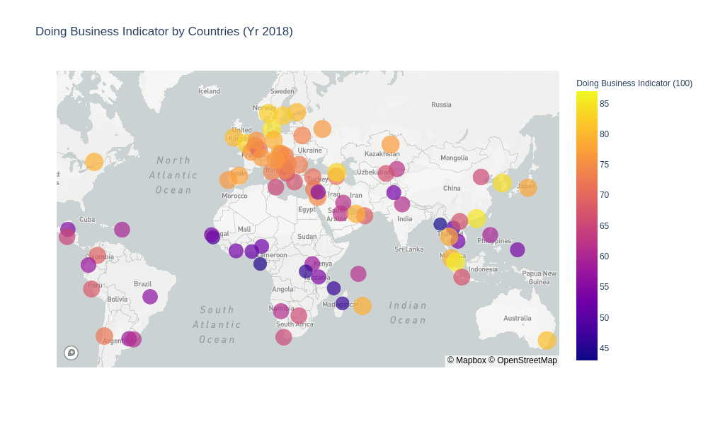

## Analysis of Observations & Results
* The pilot/preliminary study indicates that the correlation and regression coefficients are positive for the three indepenent variables.
* For GDP and Innovation & Technology, the coefficients of regressions are relatively small. China plays a big role in causing the flatter slope. 
* For Doing Business Indicator, the coefficient of regression is very high. The steep slope suggests that the improvement of countries' business infrastructure has a large positive effect on increasing their FDI in the USA. 
* Europe
* Asia
* LA
* Africa

## Limitations & Conclusion
* The scope of the pilot/preliminary study was limited by the smaller datatset. 
* The study investigates the dataset for a recent year (2018); however, the analyses were restricted within a single year.
* The stock of FDI was applied to measure the dependent variable; the findings are needed to be cross-checked by using the alternative measures of FDI. 
* Extension of the pilot/preliminary study intends to collect data on the key variables for multiple years (greater than or equal to 10 years).
* The extended time series analysis will provide us with insights for both the static and dynamic relationship among the key variables.
* Examining the alternative measures of FDI (e.g. financial transaction based FDI and income flow based FDI) will add value to the future research.  
